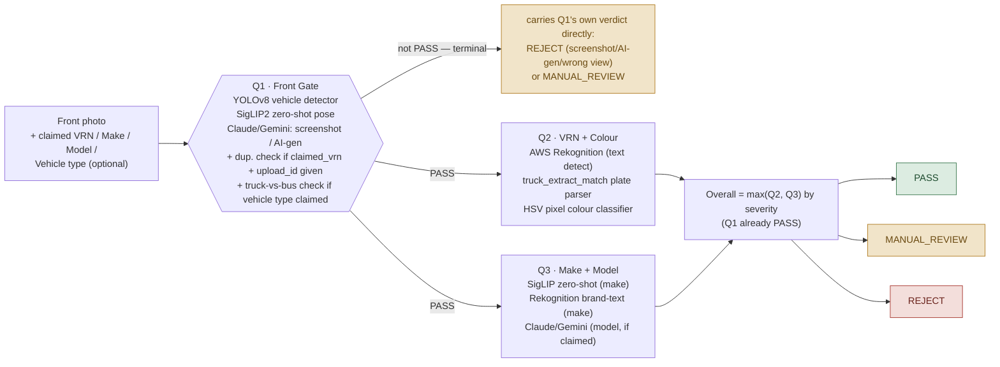
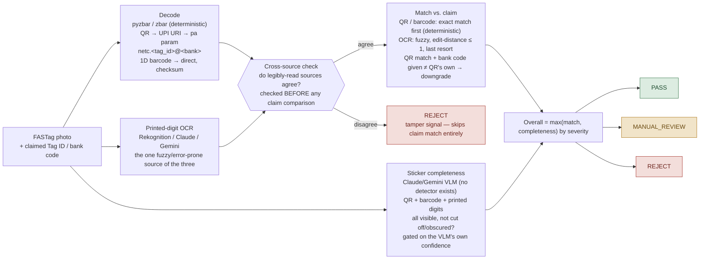

# KYV Verification

Know-Your-Vehicle (KYV) image verification for truck/bus onboarding. Given an
uploaded photo claimed to be a vehicle's **front**, **side/axle**, or **FASTag
sticker**, decide whether it genuinely is one — and whether it matches the
claim on file — before any downstream document processing runs on it.

## Repository layout

| Project | What it is |
|---|---|
| [`truck_extract_match/`](truck_extract_match/README.md) | Shared extract-and-match logic (plate/VRN read + make read → domain-normalise → match claimed value → `MATCH` / `MISMATCH` / `UNREADABLE`). Installed as a real dependency of `vehicle_image_validator`. |
| [`vehicle_image_validator/`](vehicle_image_validator/README.md) | The image validator itself — Q1/Q2/Q3 front-image checks, side/axle identity + axle-count checks, FASTag checks, duplicate detection, and the Gradio test webapp. |

See each project's own README for setup, environment variables, and how to run
its tests/webapp.

## End-to-end verification checkpoint manual

How each **End-to-end** upload is actually decided — the real model/script
behind every station, in the order a photo passes through it (front → side/axle
→ FASTag), and the exact formula that resolves it to `PASS`, `MANUAL_REVIEW`,
or `REJECT`.

> An interactive version of this manual (hand-drawn diagrams, light/dark theme)
> is published at: https://claude.ai/code/artifact/2e5e94d0-24fe-4ef2-b706-33e3e9754dc8

**Legend** — 🟢 `PASS` cleared · 🟡 `MANUAL_REVIEW` a human decides · 🔴 `REJECT` fails a hard check

Scope: these are the **end-to-end** flows only. The isolated per-check sub-tabs
(Q1-only, Axle-only, QR-only, etc.) exist for backend comparison and aren't
reproduced here. Thresholds below reflect current defaults in `config.py`;
several (`SIDE_IMAGE_SIMILARITY_MIN`, `SIDE_IMAGE_COLOR_HIST_MIN`,
`DUPLICATE_SIMILARITY_MIN`, `SIDE_IMAGE_COMPLETENESS_MIN`,
`FASTAG_COMPLETENESS_CONF_MIN`) are explicitly flagged as uncalibrated in the
code and worth validating against real labeled pairs before relying on them in
production. All of these are overridable per-call, not just via env var — see
each check function's own arguments.

---

### 01 · Front Image — `production-wired`

Q1 gates Q2 and Q3 entirely — nothing else runs unless Q1 clears. Live in
production as `combined.py::validate_upload`; the webapp's End-to-end tab
(`experiments/runner.py::run_test_case`) runs the identical decision logic
with swappable backends for comparison.



Q1 is a hard gate — a non-PASS short-circuits the whole upload before Q2/Q3
ever run, saving the AWS/SigLIP/Claude calls. Once Q1 clears, Q2 and Q3 run
independently (neither gates the other) and the overall decision is whichever
of the two is more severe.

| Station | Script | Tech | What it decides |
|---|---|---|---|
| Q1 · Front Gate | `front_image/front_image.py` | YOLOv8, SigLIP2, Claude/Gemini | Real vehicle? Front view? Complete? Confident enough? Not a screenshot, re-photographed print, or AI-generated image. |
| Duplicate (opt-in) | `duplicate_check.py` | SigLIP embed, pgvector | Is this image a near-duplicate of a PRIOR upload filed under a different VRN? Folded into Q1's own decision, worst-of. |
| Vehicle type (opt-in) | `backends/vehicle.py::decide_vehicle_type_match` | YOLOv8 (same detection) | Does the detected category (truck vs bus) match a CLAIMED one? Reuses Q1's own detection — no extra model call. Folded into Q1's decision, worst-of. |
| Q2 · VRN + Colour | `front_image/vrn_check.py` | AWS Rekognition, `truck_extract_match`, HSV classifier | Does the read plate number match the claimed VRN (confusable-character tolerant)? What colour is the plate? |
| Q3 · Make + Model | `front_image/make_model_check.py` | SigLIP zero-shot, Rekognition text, Claude/Gemini | Does either real-model source agree the make matches? If a model designation was claimed and read confidently, does it fuzzy-match? |

**Verdict formula — Front Image**

- 🔴 **REJECT** — Q1: screenshot, re-photographed print, AI-gen ≥ `85%`, wrong vehicle/view (not truck/bus at all), incomplete front, or confidence < `60%` — any one is terminal.
- 🔴 **REJECT** — Q1 PASSes, then Q2 plate mismatch, OR Q3 make mismatch on *both* sources, OR claimed model read confidently and mismatched.
- 🟡 **MANUAL_REVIEW** — Q1: AI-gen suspected but confidence < `85%`. Or a vehicle type was claimed and the detected category (truck/bus) disagrees, or nothing was detected to compare. Or Q2 plate unreadable. Or Q3 claimed model read but `UNREADABLE`.
- 🟢 **PASS** — Q1 clears (including the vehicle-type check, if a type was claimed), and both Q2 and Q3 independently resolve to PASS. `overall = max(Q2, Q3, key=severity)`

---

### 02 · Side / Axle Image — `webapp / test-only`

Not called from any production entry point yet — lives in
`side_image/side_image_check.py::check_side_image_upload`, exercised through
the webapp's End-to-end tab. Five independent checks, worst-of combined;
completeness and axle/identity always run, duplicate and vehicle type are
opt-in via `upload_id`/`claimed_vehicle_type` respectively.

```mermaid
flowchart LR
    IN2["Side/axle photo\n+ claimed VRN / Make / AxleCount /\nVehicle type (optional)\n+ front reference image"] --> COMPLETE
    IN2 --> DUP
    IN2 --> AXLE
    IN2 --> IDENT
    IN2 --> VTYPE

    COMPLETE["Completeness\nYOLO bbox vs. frame edge\n(reuses Q1's own gate.completeness_score)\nis the truck cut off at an edge?\nlenient vs. Q1 -- long trucks legitimately crop"]
    DUP["Duplicate · optional\nSigLIP embed → pgvector\nimage_type=\"side\"\nruns only if upload_id given\nnever REJECTs on its own"]
    AXLE["Axle Count\nClaude/Gemini VLM\nwheelbase walk-through, 2-7 axles\nvs claimed count, conf ≥ 70%\n+ RC consistency (if axle_source given)\nauto → trusted / manual → vs vehicle_mapper"]
    IDENT["Identity Binding\nClaude/Gemini → bucket\nroutes on windshield/plate visibility\nvrn_visible → reuse Q2 logic\ncorner_view → embed + colour-hist\npure_side_profile → colour-hist only\n(decreasing reliability, top to bottom)"]
    VTYPE["Vehicle Type · optional\nsame YOLO detection as Completeness\ntruck vs bus vs claimed category\nruns only if vehicle type claimed\nnever REJECTs on its own"]

    COMPLETE --> COMB2["Overall = max(completeness, dup, axle,\nidentity, vehicle type) by severity"]
    DUP --> COMB2
    AXLE --> COMB2
    IDENT --> COMB2
    VTYPE --> COMB2
    COMB2 --> P2[PASS]
    COMB2 --> M2[MANUAL_REVIEW]
    COMB2 --> R2[REJECT]

    classDef pass fill:#dcece1,stroke:#3c7a50,color:#1f4d30;
    classDef manual fill:#f1e4c9,stroke:#b07c22,color:#6b4b12;
    classDef reject fill:#f3dedb,stroke:#a93b33,color:#6b241d;
    class P2 pass
    class M2 manual
    class R2 reject
```

Unlike Front Image, none of these five checks gate each other — all run
(duplicate only if `upload_id` is given, vehicle type only if
`claimed_vehicle_type` is given) and the worst result wins. The
identity-binding bucket only ever reaches PASS through `corner_view`; the
other two buckets are deliberately capped below it, and completeness and
vehicle type are capped below it too — both reuse the same real YOLO
detection Q1 uses, but neither can REJECT on its own here: completeness is
UNCALIBRATED for this framing (a long truck legitimately runs off-frame more
than a compact front-on shot), and the detector is an off-the-shelf COCO
model not fine-tuned for Indian trucks/buses, so a truck-vs-bus mismatch is a
lead for a human, not grounds to auto-reject.

| Station | Script | Tech | What it decides |
|---|---|---|---|
| Completeness | `check_side_completeness` | YOLOv8, bbox-vs-edge heuristic | Is the truck's bounding box touching a frame edge, suggesting it's cut off? Reuses Q1's own detector + `gate.completeness_score`, lenient threshold. |
| Duplicate | `duplicate_check.py` | SigLIP embed, pgvector | Near-duplicate of a prior upload under a different VRN? `image_type="side"` — never compared against front/FASTag. |
| Axle Count | `side_image/side_image_check.py` | Claude/Gemini VLM | Counts axle positions front-to-rear (dual wheels vs. tandem/tridem bogies), citing the specific visual evidence per axle — never a brand/model assumption. |
| RC consistency | `decide_axle_source_consistency` | lookup table | Manually-entered axle count vs. the vehicle's own `vehicle_mapper` class (e.g. `VC12 → 4`). Auto-filled counts are trusted as-is. |
| Bucket routing | `classify_side_image_type` | Claude/Gemini VLM | Is a plate legible? Is the windshield visible (a forward-facing angle) or edge-on (a true side profile)? |
| `corner_view` identity | `_identity_via_corner_view` | SigLIP embed, RGB histogram | 1:1 embedding similarity AND colour-histogram vs. this truck's own on-file front photo — both against a vehicle-only crop. |
| `pure_side_profile` identity | `_identity_via_pure_side_profile` | RGB histogram | Colour-histogram only (angle-invariant) vs. the front reference — no plate, no grille, nothing else to check. |
| Vehicle type (opt-in) | `check_side_vehicle_type` | YOLOv8 (same detection as Completeness) | Does the detected category (truck vs bus) match a CLAIMED one? Shares `backends/vehicle.py::decide_vehicle_type_match` with Q1. |

**Verdict formula — Side / Axle Image**

- 🔴 **REJECT** — Axle count mismatch (confidence ≥ `70%`), OR manually-entered count disagrees with the RC-derived `vehicle_mapper` table.
- 🔴 **REJECT** — `vrn_visible` bucket only: plate read, but doesn't match the claim.
- 🟡 **MANUAL_REVIEW** — Axle read confidence < `70%`. Or completeness score < `0.5` (truck bbox touches a frame edge). Or a vehicle type was claimed and the detected category disagrees, or nothing was detected to compare. Or duplicate flags a near-identical prior upload under a different VRN. Or `corner_view`'s embed < `0.97` or colour-hist < `0.80` (either alone). Or `pure_side_profile`, always — match or mismatch. Or no front reference photo at all.
- 🟢 **PASS** — Completeness clears (a truck was detected AND its bbox score ≥ `0.5`), the vehicle-type check clears if one was claimed, axle matches (+ RC-consistent), AND identity resolves PASS — only reachable via `vrn_visible` match or `corner_view` clearing BOTH thresholds.

---

### 03 · FASTag — `webapp / test-only`

Also not wired into production — `fastag_image/fastag_check.py::check_fastag_upload`.
Three identity sources read off one sticker; a disagreement between whichever
were legibly read is itself a REJECT, checked *before* any of them are
compared to the claim. A fourth, independent check asks whether the whole
sticker was even captured in the first place.



Forging a QR, a checksummed barcode, AND matching printed digits all at once
is a much higher bar than editing the visible digits alone — which is why
disagreement between sources is judged before the claim ever enters the
picture. A photo cropped tight to just the QR code can still legitimately
match on identity alone — the QR is enough — so completeness is checked
separately rather than folded into "nothing readable." Duplicate check
(optional, `image_type="fastag"`) folds into the final result the same way as
the other two image types.

| Station | Script | Tech | What it decides |
|---|---|---|---|
| Decode | `backends/fastag_reader.py` | pyzbar / zbar | QR (parsed as a UPI deep link — tag id/bank live in the `pa` param) and 1D barcode, both deterministic — no model, no "backend" to swap. |
| Printed-digit OCR | `read_fastag` | Rekognition, Claude, Gemini | Reads the human-readable serial printed below the barcode — backend-selectable, the only swappable piece. |
| Cross-source + match | `decide_fastag` | `confusable_distance` | Consistency first (tamper signal), then match — QR/barcode exact, OCR fuzzy as the last resort. |
| Sticker completeness | `check_fastag_completeness` | Claude/Gemini VLM | Are the QR, barcode, AND printed digits all visible/uncut, independent of whether whatever WAS captured happens to read fine? No detector exists for a sticker, so a VLM judgment call. |
| QR only *(standalone)* | `decide_qr_only` | exact match | QR-parsed Tag ID vs. a claimed Tag ID alone — narrower than the full check, no cross-source verification. |
| Printed digits only *(standalone)* | `decide_printed_digits_only` | fuzzy match | OCR'd digits vs. a claimed barcode number captured independently (e.g. a handheld scanner). |
| Duplicate | `duplicate_check.py` | SigLIP embed, pgvector | Near-duplicate sticker photo filed under a different VRN? `image_type="fastag"`. |

**Verdict formula — FASTag**

- 🔴 **REJECT** — Two or more legibly-read sources disagree with each other — checked FIRST, before any claim comparison.
- 🔴 **REJECT** — Sources agree, something legible was read, but it doesn't match the claimed Tag ID.
- 🟡 **MANUAL_REVIEW** — Nothing readable at all (a bad photo isn't proof of fraud). Or QR matched but claimed bank code disagrees with the QR's own. Or the sticker completeness read is confidently "incomplete," or its own confidence is < `70%` (too uncertain either way). Or duplicate flags a near-identical prior upload under a different VRN.
- 🟢 **PASS** — Sources agree, the Tag ID matches (via QR/barcode exact match first, OCR fuzzy match ≤1 confusable edit only as the last resort), AND the sticker completeness read is a confident "complete."

---

### The verdict algebra

Every end-to-end check above resolves the same way once its sub-checks have
each returned a verdict: take the single most severe one. No image type
invents its own combining rule.

```
REJECT (severity 2)  >  MANUAL_REVIEW (severity 1)  >  PASS (severity 0)
```

- **Gating vs. worst-of.** Front Image is the exception: Q1 *gates* Q2/Q3 (a non-PASS skips them outright). Side/Axle and FASTag never gate their own sub-checks — everything that can run, does, and the worst result wins.
- **REJECT is never automatic on a soft signal.** Every embedding-similarity or colour-histogram threshold in this manual is explicitly uncalibrated, and the off-the-shelf COCO vehicle detector (framing completeness, truck-vs-bus category) is documented as weak on Indian trucks/buses. None of these can independently REJECT — a failure there tops out at MANUAL_REVIEW, by design.
- **A bad photo is never proof of fraud.** Nothing readable, at any station, across all three image types, resolves to MANUAL_REVIEW — never REJECT. REJECT is reserved for a legible signal that actively disagrees.
